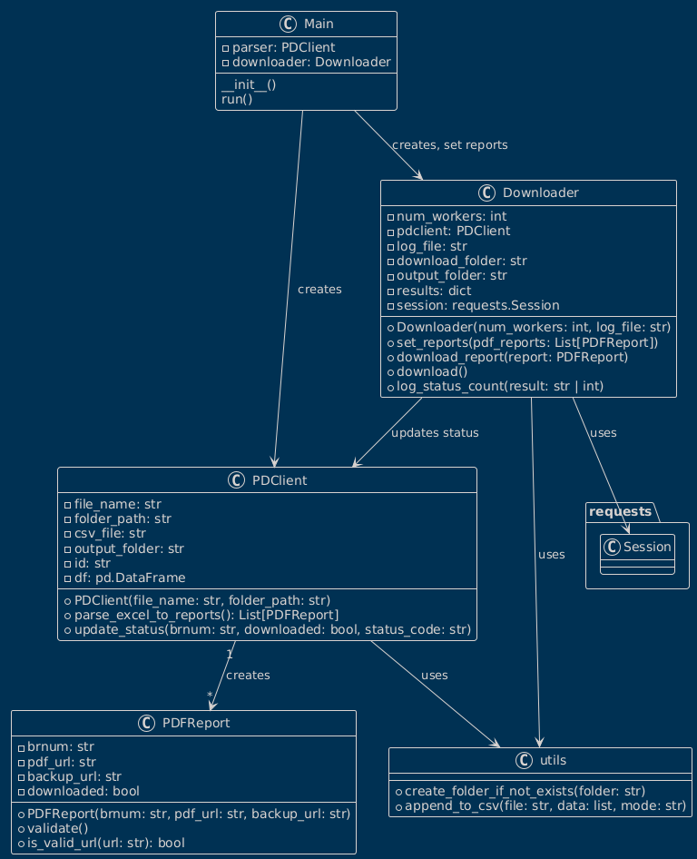

# PDF Report Downloader

This project is a **PDF Report Downloader** that automates the process of downloading PDF reports from a list of URLs provided in an Excel file. The program supports retry logic, backup URLs, and concurrency to efficiently handle multiple downloads.

## Features

- Parses an Excel file to extract report URLs.
- Downloads PDF reports from primary URLs, with fallback to backup URLs if the primary fails.
- Automatically retries failed downloads for specific HTTP status codes (e.g., 500, 502, 503, 504).
- Logs download statuses and updates a CSV file with the results.
- Supports concurrent downloads for improved performance.

## Requirements

- Python 3.8 or higher
- The following Python libraries:
  - `pandas`
  - `requests`
  - `urllib3`
  - `tqdm`
  - `openpyxl` 

## Installation

1. Clone the repository:
   ```bash
   git clone https://github.com/your-repo/pdf-report-downloader.git
   cd pdf-report-downloader
   ```
2. Install the required dependencies:
    ```bash
    pip install -r requirements.txt
    ```

## Usage

1. Run the program:
```bash
python main.py
```
2. What the program does:
    - Parses the excel file and extracts report URLs.
    - Attempts to download PDF reports from the primary URLs
    - If the primary url fails it tries the backup URL
    - Saves the downloaded PDF reports in the downloads folder
    - Logs status of download and status_code count in the output folder
3. Outputs:
    - Downloaded PDFs are saved in the downloads folder with filenames based on BRnum of each report.
    - A status log csv file that contains:
        - BRnum: The identifier for the report
        - Downloaded: Whether the download was successful or not (Yes/No)
        - Status Code: The returned status code of the request
    - A status code count .csv file that counts the amount of times each status_code has been registered.

4. The program runs with the logger level set to "INFO" to avoid printing exceptions.

## Uml Diagram

The UML diagram below illustrates the structure of the project and the relationships between its main components:

- PDFReport: A signle report with attributes Here’s a **UML Diagram** section with a description that you can add to your README.md:

---

## UML Diagram

The UML diagram below illustrates the structure of the project and the relationships between its main components:

- **PDFReport**: Represents a single report with attributes `brnum`, `pdf_url`, and `backup_url`. It includes methods for validating URLs.
- **PDClient**: Responsible for parsing the Excel file and creating `PDFReport` objects. It also updates the status of reports after downloads.
- **Downloader**: Handles downloading of PDF reports. It supports retry logic, processes multiple reports concurrently, and logs the download status.
- **Utils**: Provides utility functions such as appending data to CSV files and creating folders if they don't exist.
- **Main**: The entry point of the program. It orchestrates the workflow by initializing the `PDClient` and `Downloader` and running the download process.



## Project Structure
                                                                    
```bash
Uge 4/  
├── models/  
│   ├── Downloader.py       # Handles downloading of PDF reports  
│   ├── PDClient.py         # Parses Excel files and manages report data  
│   ├── report.py           # Defines the PDFReport class for report objects  
├── utils/  
│   ├── utils.py            # Utility functions (e.g., append_to_csv)  
│   ├── logger.py           # Logger for logging messages  
├── downloads/              # Folder where downloaded PDFs are saved  
├── output/                 # Folder for output files (e.g., status logs)  
├── main.py                 # Entry point for the program  
├── readme.md               # Project documentation  
```